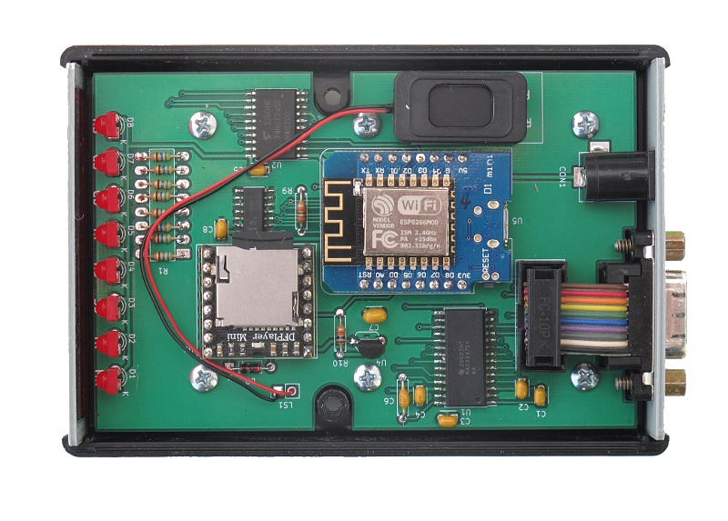
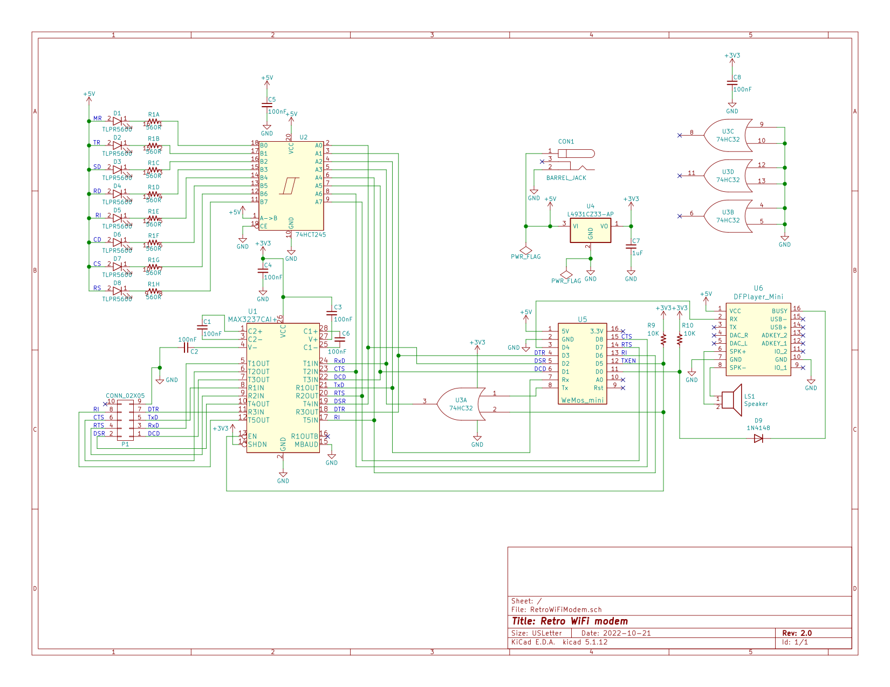

# Retro WiFi modem

## An ESP8266 based RS232 \<-\> WiFi modem with AT style commands and blinking LEDs

This project grew out of a desire to get an old Ampro LB+/Z80 hooked up
to the Internet.

Right from the start, I knew I wanted a row of LED indicators at the
front of the modem so that it would be reminiscent of an old Hayes
Smartmodem. (I briefly considered finding an old Smartmodem on eBay, but
soon remembered that the case had in fact been made of metal; they don't
build 'em like that anymore.)

Since the modem was going to be hooked up to the Little Board's
serial port, I needed an actual RS-232 level serial port, with either a
DB-25 or DE-9 connector.

And finally, since I wanted the Hayes style LEDs, I thought it would be
handy to have the Hayes AT commands too, at least as close as I could
manage.

That was all I started with. I couldn't tell you how I stumbled across
the whole WiFi modem thing; I can't even remember what terms I searched
with but very quickly I came across the message thread at [WiFi232's
Evil
Clone](http://www.vcfed.org/forum/entry.php?740-WiFi232-s-Evil-Clone&bt=1056).
Inspired by that, and [Paul Rickards'
WiFi232](http://biosrhythm.com/?page_id=1453), and [Daniel Jameson's
ESP8266 based virtual modem](https://github.com/stardot/esp8266_modem) I
got started.

I had a preliminary version put together and working by the first
evening. Then the wholesale changes to the software began. And for the
longest time, it looked like they'd never end. Eventually though, they
calmed down and "wholesale changes" downshifted to "another tweak I'd
like to make."

The hardware didn't change nearly as much from beginning to end. I did
the development on a Wemos D1 R1 and a little half length solderless
breadboard mounted together. The plan for the final hardware was always
to use a [Wemos D1
mini](https://docs.wemos.cc/en/latest/d1/d1_mini.html). A MAX3232 took
care of the 3.3V <-> RS-232 level shifting, and a 74HCT245 was used to
drive the indicator LEDs.

The only major addition to the hardware during development was an OR
gate on the serial output from the ESP8266. On startup, the ESP8266
sends out some debug information (at an oddball baud rate) through the
serial port. It shows up as garbage characters to whatever's hooked up
to the serial port. It annoyed me enough that I fed the Tx signal
through the OR gate, with the other input hooked up to an output pin
that I could count on remaining high (thereby masking off the Tx signal)
until after the sketch had started and set it low.

## Status

Is a personal project like this ever *really* finished? I've finished
the first complete unit and while I don't expect the hardware to change
(much), the software is a completely different story. I expect to be
tweaking and adding to that for some time to come. However, it's
completely usable at the moment.

## The Hardware

I made the decision to use through hole components throughout; retro
components for a retro modem. Besides, I already had most of them in my
parts box!

In keeping with the retro theme, the modem uses classic Hayes style
blinking LEDs and a DE-9F for the RS-232 connector. Everything is
displayed: RTS, CTS, DSR, DTR, DCD, RI, TxD and RxD. However, only RxD,
TxD, RTS and CTS are actually brought out on the DE-9F connector. The
Ampro LB only brought those four signals out so it would have been
overkill for the modem I was designing for it to support anything more.
Additionally, it would have required another three MAX3232 ICs to do it
(had the MAX3237 been available in DIP, I *might* have had a harder time
saying no...).

The PCB is laid out for a
[Wemos D1 mini](https://docs.wemos.cc/en/latest/d1/d1_mini.html) and the
software expects to see just that. If you're just using the software and
not the PCB, there's no reason you couldn't use another kind of ESP8266
board; I used a D1 R1 myself when I was developing the modem. You'd just
need to add pin definitions for your board in RetroWifiModem.h.

A separate 3.3V regulator is used to power the MAX3232 IC and 74HC32
quad OR gate. Some (most?) D1 mini clones have the smallest 3.3V
regulator on board that they can get away with to power the board, and
they don't have a lot of mA's left over to power anything else. Better
safe than sorry.

The power connector expects a 2.1mm I.D. x 5.5mm O.D. barrel plug,
delivering 5 volts, centre positive.  I used a Tri-Mag L6R06H-050 (5V,
1.2A), [Digikey part#
364-1251-ND](https://www.digikey.com/product-detail/en/tri-mag-llc/L6R06H-050/364-1251-ND/7682614).
If you plug in a 9V adapter like you'd use for an Arduino, you *will*
let the magic smoke out and have an ex-modem on your hands.

On the off chance that there's someone else out there with a well
stocked parts box and a burning desire to put together their own WiFi
modem, there's a [BOM](kicad/RetroWiFiModem-bom.csv) in the kicad
subdirectory. If you actually had to go out and buy all the parts, it
really wouldn't be cost effective.

Then again, how practical is getting an Ampro Little Board on the
Internet? Practicality isn't always everything. Sometimes nostalgia is
worth the effort.

### Didn't make the cut

I have to admit that I semi-seriously considered adding one of those
little audio playback modules for faux dialling and connection sounds.
It would have been in keeping with the whole retro theme. But in the end
I decided not to. Maybe next time.

## The case

Like I said as the start, I would have loved to have used an old Hayes
Smartmodem case, but they were metal and wouldn't have allowed the WiFi
to work particularly well.

In the end I went with a Hammond 1593N case (DigiKey part # HM963-ND or
HM964-ND depending on whether you like black or grey). STL and OpenSCAD
files are included for the front and back panels. You could use the
proper Hammond red panel for the front (DigiKey part # HM965-ND), *but*
they're only available in 10 packs and their price is highway robbery.
I ended up using a slightly smaller red panel (DigiKey part # HM889-ND)
that was much cheaper and available in single units.

## The PCB

The PCB includes cutouts for the two columns that join the case
together, and mounting holes for the 6 standoffs. Also, there's an oddly
shaped cutout in back end to allow a particular IDC DE-9F I had on hand.
It's available from DigiKey (or a very close clone is) but it's fairly
pricey. But there's plenty of room for an ordinary solder cup DE-9F.
You'd most likely want to omit the 10 pin header and just wire the DE-9F
right to the board.

You might notice that the vias are unusually large by today's standards.
The reason for that is to allow the option of constructing the PCB as a
single sided board, replacing the top layer of copper with 11 jumpers.

## The Software

In a nod to its popularity, the command set I used largely follows that
used in [Paul Rickards' WiFi232](http://biosrhythm.com/?page_id=1453)
modem. Even if the innards are completely different, it made sense to
make it *work* like what people where already used to. There's a reason
everyone's been copying the Hayes command set for almost 40 years!

### First time setup

The default serial configuration is 1200bps, 8 data bits, no parity, 1
stop bit.

Here's the commands you need to set up the modem to automatically
connect to your WiFi network:

1. `AT$SSID=your WiFi network name` to set the WiFi network that the
modem will connect to when it powers up.
2. `AT$PASS=your WiFi network password` to set the password for the
network.
3. `ATC1` to connect to the network.
4. Optional stuff:
   * `AT$SB=speed` to set the default serial speed.
   * `AT$SU=dps` to set the data bits, parity and stop bits.
   * `ATNETn` to select whether or not to use Telnet protocol.
   * `AT&kn` to use RTS/CTS flow control.
5. `AT&W` to save the settings.

Once you've done that, the modem will automatically connect to your WiFi
network on power up and will be ready to "dial up" a connection with
ATDT.

### Command Reference

Multiple AT commands can be typed in on a single line. Spaces between
commands are allowed, but not within commands (i.e. AT S0=1 X1 Q0 is
fine; ATS 0=  1 is not). Commands that take a string as an argument
(e.g. AT$SSID=, AT$TTY=) assume that *everything* that follows is a part
of the string, so no commands are allowed after them.

#### +++

Online escape code. Once your modem is connected to another device, the
only command it recognises is an escape code of a one second pause
followed by three typed plus signs and another one second pause,
which puts the modem back into local command mode.

#### A/

Repeats the last command entered. Do not type AT or press Enter.

#### AT

The attention prefix that precedes all command except A/ and +++.

#### AT?

Displays a help cheatsheet.

#### ATA

Force the modem to answer an incoming connection when the conditions
for auto answer have not been satisfied.

#### ATC?, ATC*n*

Query or change the current WiFi connection status. A result of 0 means
that the modem is not connected to WiFi, 1 means the modem is connected.
The command ATC0 disconnects the modem from a WiFi connection. ATC1
connects the modem to the WiFi.

#### ATDS*n*

Calls the host specified in speed dial slot *n* (0-9).

#### ATDT*host[:port]*

Tries to establish a WiFi TCP connection to the specified host name or
IP address. If no port number is given, 23 (Telnet) is assumed. You can
also use ATDT to dial one of the speed dial slots in one of two ways:

* The alias in each speed dial slot is checked to see if it matches the
specified hostname.
* A host specified as 7 identical digits dials the slot indicated by the
digit. (i.e. 2222222 would speed dial the host in slot 2).

#### ATE?, ATE*n*

Command mode echo. Enables or disables the display of your typed commands.

* E0 Command mode echo OFF. Your typing will not appear on the screen.
* E1 Command mode echo ON. Your typing will appear on the screen.

#### ATGET*http://host[/page]*

Displays the contents of a website page. **https** connections are not
supported. Once the contents have been displayed, the connection will
automatically terminate.

###ATH

Hangs up (ends) the current connection.

#### ATI

Displays the current network status, including sketch build date, WiFi
and call connection state, SSID name, IP address, and bytes transferred.

#### ATNET?, ATNET*n*

Query or change whether telnet protocol is enabled. A result of 0 means
that telnet protocol is disabled; 1 is *Real* telnet protocol and 2 is
*Fake* telnet protocol. If you are connecting to a telnet server, it may
expect the modem to respond to various telnet commands, such as terminal
name (set with `AT$TTY`), terminal window size (set with `AT$TTS`)
or terminal speed. Telnet protocol should be enabled for these sites,
or you will at best see occasional garbage characters on your screen,
or at worst the connection may fail.

The difference between *real* and *fake* telnet protocol is this: with
*real* telnet protocol, a carriage return (CR) character being sent from
the modem to the telnet server always has a NUL chararacter added after
it. The implementation of the telnet protocol used by some BBSes doesn't
properly strip out the NUL character. When connecting to such BBSes
(Particles! is one), use *fake* telnet.

When using *real* telnet protocol, when the telnet server sends a CR
character followed by a NUL character, only the CR character will be
sent to the serial port; the NUL character will be silently stripped out.
With *fake* telnet protocol, the NUL will be passed through.

#### ATO

Return online. Use with the escape code (+++) to toggle between command
and online modes.

#### ATQ?, ATQ*n*

Enable or disable the display of result codes. The default is Q0.

* Q0 Display result codes.
* Q1 Suppress result codes (quiet).

#### ATRD/ATRT

Displays the current UTC date and time from NIST in the format *YY-MM-DD HH:MM:SS*.
A WiFi connection is required and you cannot be connected to another site.

#### ATS0?, ATS0=*n*

Display or set the number of "rings" before answering an incoming
connection. Setting `S0=0` means "don't answer".

#### ATV?, ATV*n*

Display result codes in words or numbers. The default is V1.

* V0 Display result codes in numeric form.
* V1 Display result codes in text form.

#### ATX?, ATX*n*

Control the amount of information displayed in the result codes. The
default is X1 (extended codes).

* X0 Display basic codes (CONNECT, NO CARRIER)
* X1 Display extended codes (CONNECT speed, NO CARRIER (connect time))

#### ATZ

Resets the modem.

#### AT&F

Reset the NVRAM contents and current settings to the sketch defaults.
All settings, including SSID name, password and speed dial slots are
affected.

#### AT&K?, AT&K*n*

Data flow control. Prevents the modem’s buffers for received and
transmitted from overflowing.

* &K0 Disable data flow control.
* &K1 Use hardware flow control. Requires that your computer and software
support Clear to Send (CTS) and Request to Send (RTS) at the
RS-232 interface.

#### AT&R?, AT&R=*server password*

Query or change the password for incoming connections. If set, the user
has 3 chances in 60 seconds to enter the correct password or the modem
will end the connection.

#### AT&V*n*

Display current or stored settings.

* &V0 Display current settings.
* &V1 Display stored settings.

#### AT&W

Save current settings to NVRAM.

#### AT&Zn?, AT&Z*n*=*host[:port],alias*

Store up to 10 numbers in NVRAM, where *n* is the position 0-9 in
NVRAM, and *host[:port]* is the host string, and *alias* is the speed
dial alias name. The host string may be up to 50 characters long, and
the alias string may be up to 16 characters long.

Example: `AT&Z2=particlesbbs.dyndns.org:6400,particles`

This number can then be dialled in any of the following ways:

* `ATDS2`
* `ATDTparticles`
* `ATDT2222222`

#### AT$AE?, AT$AE=*startup AT command*

Query or change the command line to be executed when the modem starts up.

#### AT$BM?, AT$BM=*server busy message*

Query or change a message to be returned to an incoming connection if
the modem is busy (i.e. already has a connection established).

#### AT$MDNS=*mDNS name*

Query or change the mDNS network name (defaults to "espmodem"). When
a non zero TCP port is defined, you can telnet to that port with
**telnet mdnsname.local port**.

#### AT$PASS=*WiFi password*

Query or change the current WiFi password. The password is case
sensitive. Clear the password by issuing the set command with no
password. The maximum length of the password is 64 characters.

#### AT$SB?, AT$SB=*n*

Query or change the current baud rate. Valid values for "n" are 110,
300, 450, 600, 710, 1200, 2400, 4800, 9600, 19200, 38400, 57600, 76800
and 115200. Any other value will return an ERROR message. The baud rate
is silently changed when a valid value is entered; no OK message is
returned. The default baud rate is 1200. The Retro WiFi modem does not
automatically detect baud rate like a dialup modem. The baud rate
setting must match that of your terminal to operate properly. It will
display garbage in your terminal otherwise.

#### AT$SP?, AT$SP=*n*

TCP server port to listen on. A value of 0 means that the TCP server is
disabled, and no incoming connections are allowed.

#### AT$SSID?, AT$SSID=*ssid name*

Query or change the current SSID to the specified name. The given SSID
name is case sensitive. Clear the SSID by issuing the set command with
no SSID. The maximum length of the SSID name is 32 characters.

#### AT$SU?, AT$SU=*dps*

Query or change the current number of data bits ('d'), parity ('p') and
stop bits ('s") of the serial UART. Valid values for 'd' are 5, 6, 7 or
8 bits. Valid values for 'p' are (N)one, (O)dd or (E)ven parity. Valid
values for 's' are 1 or 2 bits. The default settings are 8N1. The UART
setting must match your terminal to work properly.

#### AT$TTL?, AT$TTL=*telnet location*

Query or change the Telnet location value to be returned when the
Telnet server issues a SEND-LOCATION request. The default value is
"Computer Room".

#### AT$TTS?, AT$TTS=*WxH*

Query or change the window size (columns x rows) to be returned when
the Telnet server issues a NAWS (Negotiate About Window Size) request.
The default value is 80x24.

#### AT$TTY?, AT$TTY=*terminal type*

Query or change the terminal type to be returned when the
Telnet server issues a TERMINAL-TYPE request. The default value is
"ansi".

#### AT$W?, AT$W=*n*

Startup wait.

* $W=0 Startup with no wait.
* $W=1 Wait for the return key to be pressed at startup.

### Updating the Software

While I liked the idea of being able to update the software OTA, it
seemed to make more sense in my situation to be able to *push* a new
version as I built it rather than have the modem *pull* it. So that's
what I did. It uses the default OTA upload capability built into the
Arduino IDE.

## References

[WiFi232 - An Internet Hayes Modem for your Retro Computer](http://biosrhythm.com/?page_id=1453) 
[WiFi232's Evil Clone](http://www.vcfed.org/forum/entry.php?740-WiFi232-s-Evil-Clone&bt=1056) 
[Virtual modem for ESP8266](https://github.com/jsalin/esp8266_modem) 
[ESP8266 based virtual modem](https://github.com/stardot/esp8266_modem) 
[ESP8266 based virtual modem](https://github.com/RolandJuno/esp8266_modem)

## Acknowledgments

* A whole lot of people owe a big vote of thanks to Jussi Salin for
releasing their virtual modem code for the ESP8266 and starting the
ball rolling.
* Paul Rickards for an amazing bit of hardware to draw inspiration from.
* All the Stardot contributors for their work.
* And, of course, Dennis C. Hayes for creating something so simple and
elegant that has stood the test of time.
